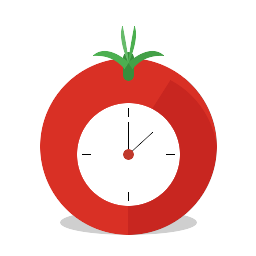

<div align="center">
  
  <h1>YAPA 2 — Linux</h1>
  <p><strong>Yet Another Pomodoro App</strong> — a lightweight, transparent Pomodoro timer that lives on your desktop.</p>
  <p>
    A cross-platform <a href="https://avaloniaui.net">Avalonia</a> port of the original
    <a href="https://github.com/YetAnotherPomodoroApp/YAPA-2">YAPA-2</a> (which was WPF/Windows-only),
    built to run natively on Linux.
  </p>
</div>

---

## What it looks like

A small, transparent clock sits in the corner of your screen. It stays out of the way, flashes when a session ends, and shows controls only when you hover over it.

---

## Features

### Timer
- Full Pomodoro cycle: Work → Short Break → Long Break
- Configurable durations for each phase
- Count forwards or backwards (display elapsed or remaining time)
- Auto-start break after work ends, and/or auto-start work after break ends
- Flash animation when a phase ends (red for work end, green for break end)
- Space to start/pause, Escape to stop

### Appearance
- Transparent, borderless, always-on-top overlay
- Adjustable widget size, clock opacity, text colour, drop shadow, and digit cell width
- Hide seconds, hide buttons (hover-reveal mode), minimize to tray
- Two themes: **YAPA 1.0** (classic minimal clock) and **Motivational** (fullscreen quote + timer on break)
- All settings update the live timer instantly — no restart needed

### Sound
- Custom sound files for period start and period end
- Background music per phase (work / break / long break) with per-track repeat toggle
- Global volume control and kill-switch

### System tray
- Tray icon with live tooltip showing current phase and countdown
- Context menu: Show, Start, Pause, Stop, Skip, Settings, Exit

### Dashboard (Settings → Dashboard)
- Completed pomodoros today
- Approximate focused time today (derived from stored session durations)
- Last 7 days bar chart — updates automatically when a session completes

### Other
- Session restore: if the app is restarted mid-session you're offered to resume
- Command-line control from a second instance: `yapa2 /start`, `/stop`, `/pause`, `/reset`, `/skip`, `/settings`
- **Reset to defaults** button in settings
- Data stored in `~/.local/share/YAPA2/Yapa.db` (SQLite) — history is preserved across reinstalls

---

## Installation

### Requirements
- Linux x86-64
- `sudo` access (to place the binary in `/usr/local/bin`)
- ImageMagick is **not** required at runtime — only needed if you want to rebuild the icon PNGs from the SVG source

### One-shot install

```bash
git clone https://github.com/ArvindParekh/yapa2-linux.git
cd yapa2-linux
bash install.sh
```

The script will:
1. Find your `dotnet` installation (checks `$PATH`, then `~/.dotnet/dotnet`)
2. Publish a self-contained, single-file release binary for `linux-x64`
3. Install the binary to `/usr/local/bin/yapa2`
4. Install the icon at all standard hicolor sizes (16 → 512 px) plus SVG
5. Register the `.desktop` entry so YAPA 2 appears in your app launcher

### Running

```bash
yapa2          # launch normally
yapa2 /start   # start the timer immediately
yapa2 /settings
```

### Updating

```bash
git pull
bash install.sh
```

---

## Building from source

```bash
# .NET 8 SDK required — https://dot.net
dotnet build YAPA.Avalonia/YAPA.Avalonia.csproj -c Debug
dotnet run --project YAPA.Avalonia/YAPA.Avalonia.csproj
```

For a production build without installing:

```bash
bash publish-linux.sh
./out/linux-x64/YAPA.Avalonia
```

---

## Settings reference

| Page | Setting | Default |
|------|---------|---------|
| Pomodoro | Work duration | 25 min |
| Pomodoro | Short break | 5 min |
| Pomodoro | Long break | 15 min |
| Pomodoro | Pomodoros before long break | 4 |
| Pomodoro | Auto-start break / work | off |
| Pomodoro | Count backwards | off |
| Pomodoro | Counter display | Pomodoro index |
| Pomodoro | Volume | 50 % |
| Appearance | Widget width | 200 px |
| Appearance | Clock opacity | 100 % |
| Appearance | Shadow opacity | 60 % |
| Appearance | Digit cell width | 36 px |
| Appearance | Hide seconds | off |
| Appearance | Hide buttons | off (hover-reveal) |
| Appearance | Minimize to tray | on |
| Sound | Period start / end sounds | bundled tick & ding |
| Sound | Background music per phase | none |
| Theme | Active theme | YAPA 1.0 |

The **Reset to defaults** button (bottom-left of the Settings window) restores every setting above to its default value. Changes take effect only when you click **Save**.

---

## Data & privacy

Everything is local. No telemetry, no network calls. Session history lives in:

```
~/.local/share/YAPA2/Yapa.db
```

Settings live in:

```
~/.local/share/YAPA2/Plugins/settings.json
```

---

## Credits

Based on [YAPA-2](https://github.com/YetAnotherPomodoroApp/YAPA-2) by [@floatas](https://github.com/floatas) and contributors — the original Windows/WPF Pomodoro timer. This fork ports the core engine and plugin architecture to [Avalonia](https://avaloniaui.net), adds Linux-specific fixes (X11 shadow suppression, XDG paths, process-based audio), and extends the settings and dashboard.

---

## License

[MIT](LICENSE.TXT)
